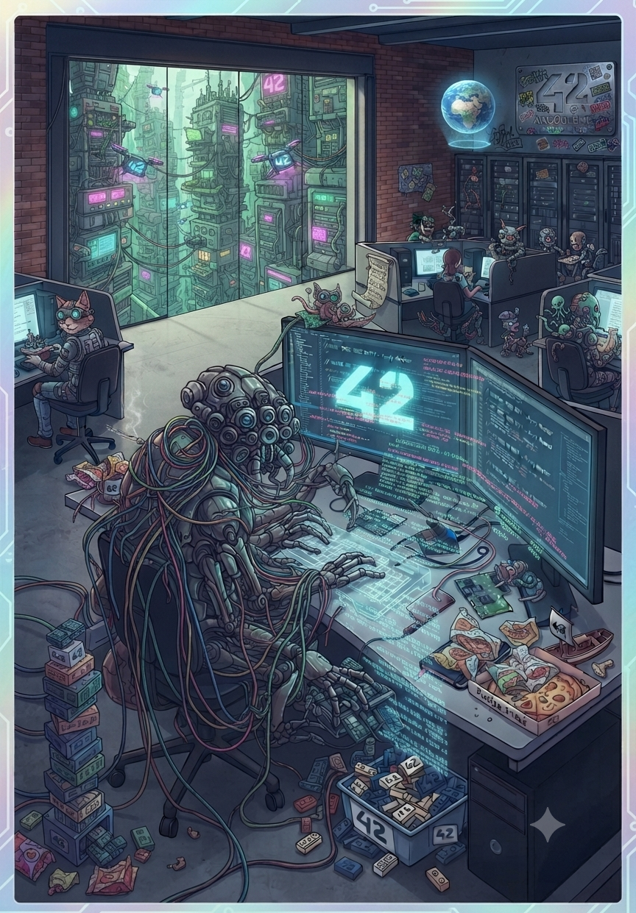

    
    
    
    
    
    
    

    <h1>TokenizeArt</h1>
    
    

        <strong>NFT ERC-721 créé sur la BNB Smart Chain</strong>
    

    

    <em>Projet « TokenizeArt » (42 × BNB Chain)</em>

---

## Présentation

**TokenizeArt** est un projet pédagogique du cursus **42**, réalisé en partenariat avec **BNB Chain**.

L'objectif : concevoir de A à Z un **jeton non fongible (NFT)** conforme au standard **BEP-721 / ERC-721**, le déployer sur une blockchain publique de test et en documenter tout le fonctionnement.

- **Un NFT unique** portant le chiffre **42** (nom `Zehd42`, symbole `Z42`)
- **Déployé sur la BNB Smart Chain Testnet** (chainId `97`)
- **Métadonnées et image stockées sur IPFS** (épinglées via Pinata)

---

## Spécifications du Token

| | |
| --- | --- |
| **Nom** | Zehd42 |
| **Symbole** | Z42 |
| **Norme** | BEP-721 (compatible ERC-721) |
| **Réseau** | BNB Smart Chain: Testnet (chainId 97) |
| **Métadonnées** | IPFS (épinglées via Pinata) |
| **Langage** | Solidity `^0.8.20` · OpenZeppelin v5.1.0 |
| **Plateforme** | REMIX IDE |
| **Mint** | Réservé au propriétaire (`onlyOwner`) |

- [***Livre blanc***](documentation/ZEHD42.md) : *Contient toutes les informations relatives au NFT*.

---

## Contrat déployé

- ***Réseau*** : BSC Testnet (Chain ID : 97)
- ***Contrat*** : `0x3fcCab7bb70aa5BCA5706B83e6Fcf08F80526ce9`
- ***Déploiement*** : [**TESTNET.BSCSCAN**](https://testnet.bscscan.com/tx/0x717d3eaf6b7001b2dee9e4cc29d15b94fb7023ce89e42379c3c475ddb5663232)
- ***Vérifié*** : Oui (code source public sur BscScan)

---

## Choix techniques

| Sujet | Choix | Raisons |
| --- | --- | --- |
| Blockchain | **BNB Smart Chain Testnet** (chainId 97) | Recommandé par le sujet, frais de test gratuits via le faucet, pas de fonds réels. |
| Standard | **BEP-721 / ERC-721** | Standard natif des NFT sur BSC. |
| Bibliothèque | **OpenZeppelin v5.1.0** (via imports GitHub) | Bibliothèque éprouvée : sécurité (réentrance, transferts sûrs) et conformité ERC-721. La v5.1.0 est choisie car elle ne dépend pas de l'opcode `mcopy` (compilation simple en EVM par défaut). |
| Métadonnées | **IPFS** | Stockage distribué exigé par le sujet ; `zehd42.json` contient le nom (`Zehd42`, porte le 42), la description, l'image, l'attribut Artiste (`alamizan`) et l'attribut Projet. |
| Accès | `onlyOwner` (OpenZeppelin Ownable) | Seul le propriétaire de la collection peut miner un NFT ; le propriétaire peut être transféré avec `transferOwnership`. |
| Nom / symbole | `Zehd42` / `Z42` | Le `42` est explicitement présent dans le nom du jeton. |

### Pourquoi Remix ?

Remix est un IDE en ligne, sans installation, qui permet de compiler, tester sur machine
virtuelle puis déployer directement via MetaMask.

C'est l'outil le plus direct pour un projet de cette taille, et il est recommandé par la documentation officielle de BNB Chain.

- [Lien vers **REMIX IDE**](https://remix.ethereum.org)

---

## Utilisation

### Configurer MetaMask sur BSC Testnet

1. MetaMask → Réseaux → **Ajouter un réseau manuellement** :
   - Nom du réseau : `BSC Testnet`
   - URL RPC : `https://data-seed-prebsc-1-s1.binance.org:8545/`
   - ID de chaîne : `97`
   - Symbole : `tBNB`
   - Explorateur : `https://testnet.bscscan.com`
2. Obtenir des tBNB gratuits via le [faucet BNB Chain](https://www.bnbchain.org/en/testnet-faucet)
3. Importer le NFT Z42 : coller l'adresse du contrat `0x3fcCab7bb70aa5BCA5706B83e6Fcf08F80526ce9` (puis le `tokenId` 1)

---

## Sécurité

- **Mint restreint** : seul le propriétaire (`onlyOwner`) peut créer des NFT.
- **Transferts sûrs** : `_safeMint` vérifie que le destinataire accepte le NFT (norme ERC-721).
- **Bibliothèque auditée** : OpenZeppelin (protection réentrance, transferts sûrs).
- **Propriété transférable** : `transferOwnership` émet `OwnershipTransferred` (traçable).
- **Zéro argent réel** : déploiement sur testnet uniquement.

---

## Démarrer

1. Copier `code/zehd42.sol` dans Remix IDE (web).
2. Compiler avec Solidity **0.8.20+** (imports OpenZeppelin v5.1.0 téléchargés depuis GitHub).
3. Déployer via **Injected Provider** (MetaMask) sur **BSC Testnet** en passant en argument `_baseURI` l'URL HTTPS de la passerelle IPFS vers le JSON de métadonnées (ex. `https://gateway.pinata.cloud/ipfs/<CID_JSON>`).
4. Miner : suivre la procédure de `mint/README.md` (appel `mintNFT` puis vérification `ownerOf`).

---

## Structure du dépôt

- `code/`: contrat Solidity `Zehd42` (`zehd42.sol`) et métadonnées du NFT (`zehd42.json`)
- `deployment/`: adresse du contrat, réseau et ABI (`abi.json`)
- `documentation/`: sujet, tutoriel, guides IPFS/Pinata
- `mint/`: instructions pour miner le NFT (`README.md`)
- `images/`: stockage des images et logos
  - `Zehd42.png` : image de l'œuvre (épinglée sur IPFS)
  - `Zehd42_02.jpeg` : version alternative, réservée à un test de déploiement lors de l'évaluation
  - `logo_nft.jpeg` : logo du projet
  - `logo_blockchain.jpeg` : logo blockchain
  - `logo_pinata.jpeg` : logo Pinata

---

## Glossaire

Le vocabulaire à connaître :

- ***Wallet (portefeuille)*** : applis comme MetaMask qui détiennent tes adresses et tes fonds.

- ***Adresse*** : une longue chaîne (0x...) qui identifie un compte, un peu comme un numéro de compte bancaire.
- **Smart contract** : un programme qui vit sur la blockchain (ici : la fabrique qui crée tes NFTs).
- ***IPFS*** : un système de stockage distribué de fichiers, idéal pour héberger l'image et les métadonnées d'un NFT de façon permanente.
- ***CID*** : l'empreinte unique d'un fichier sur IPFS (ipfs://Qm...). Il sert à retrouver l'image n'importe où.
- ***Métadonnées*** : le "dossier" du NFT (image, nom, artiste, titre...) stocké en JSON, souvent sur IPFS.
- ***Gas*** : la petite redevance en crypto payée pour exécuter une action sur la blockchain.
- ***Faucet*** : un site qui distribue gratuitement des jetons de test.
- ***Block explorer (BSCScan)*** : un moteur de recherche de la blockchain, où chaque transaction est visible.
- ***ABI*** : la "notice d'utilisation" d'un smart contract, décrivant ses fonctions.

---

## Documentation

- ***Sujet officiel*** : [`documentation/SUJET.md`](documentation/SUJET.md)
- ***Rappels blockchain*** : [`documentation/BLOCKCHAIN.md`](documentation/BLOCKCHAIN.md)
- ***Les NFT et la norme ERC-721*** : [`documentation/NFT.md`](documentation/NFT.md)
- ***Stockage distribué*** : [`documentation/IPFS.md`](documentation/IPFS.md)
- ***Epinglage IPFS*** : [`documentation/PINATA.md`](documentation/PINATA.md)
- ***Explorateur BscScan*** : [`documentation/BSCSCAN.md`](documentation/BSCSCAN.md)

---

## Auteur

**Alex Lamizana** : Étudiant 42 Angoulême, spécialisation Data & IA

- [Site](https://lamizana.github.io/ZehdBox/)
- [GitHub](https://github.com/Lamizana/TokenizeArt)

*Ce projet a été réalisé conformément à la norme et au sujet officiel de 42.*

