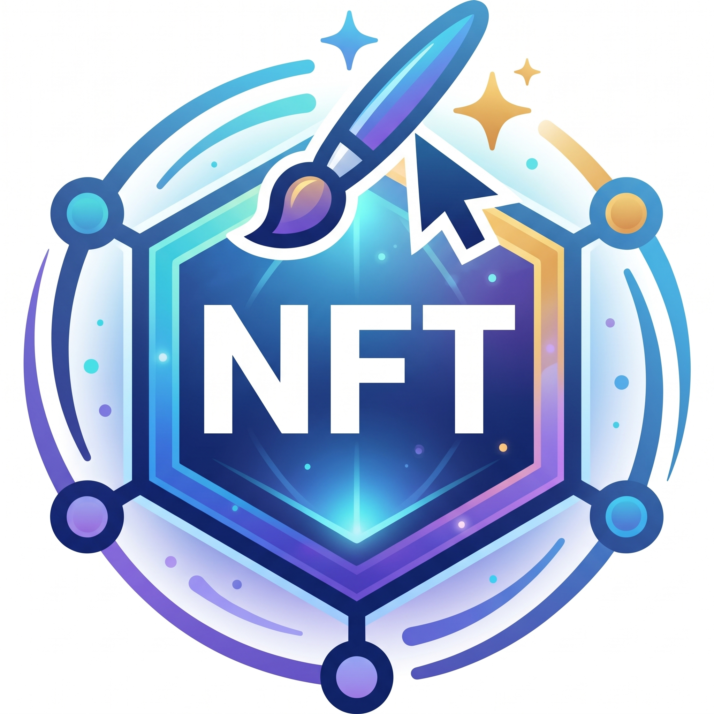

    <h1>NFT</h1>
    
    

        <em>Un NFT est un <strong>certificat numérique d'authenticité</strong> et de propriété associé à un objet virtuel ou réel, enregistré sur une <strong>blockchain</strong>.
    

---

## Qu'est-ce qu'un NFT ?

Un **NFT** (de l’anglais *non-fungible token*) ou jeton non fongible (JNF) est un objet informatique (un jeton) suivi, stocké et authentifié grâce à un protocole de [**blockchains**](./BLOCKCHAIN.md), auquel est rattaché **un identifiant numérique**, ce qui le rend unique et non fongible.

Ce jeton accorde des droits, de propriété ou autre, sur un objet réel ou virtuel comme une œuvre d'art (souvent numérique), un contrat, un diplôme etc., et est associé à un compte propriétaire comme tout jeton de blockchain, mais le jeton étant non fongible, **le propriétaire est garanti unique**, ce qui donne la valeur au jeton.

D'un point de vue technique, **les jetons non fongibles ne sont pas interchangeables**. Cette unicité de chaque jeton contraste avec la fongibilité des unités de cryptomonnaies comme le Bitcoin et de nombreux jetons utilitaires (utility token).

Ainsi, la valeur d'un jeton est déterminée par le jeu de l’offre et de la demande, sans régulation de marché, et liée à la valeur symbolique associée à l'objet représenté.

Le plus souvent, les NFT sont générés par des **contrats intelligents** associés à la blockchain Ethereum avec le modèle de ***smart contract ERC-721***.
Mais des blockchains spécifiques à la gestion des NFT apparaissent de plus en plus.

> [!NOTE]
> Les NFT se payent en général en cryptomonnaie, le plus souvent sur la même blockchain que celle des NFT.

---

## Définitions

### Identifiant numérique

**L'identité numérique** (***IDN***) est définie comme **un lien technologique** entre une entité réelle (personnes, organismes) et des entitées virtuelles (sa ou ses représentation numériques).

Elle permet *l'identification de l'individu en ligne* ainsi que la mise en relation de celui-ci avec l'ensemble des communautés virtuelles présentes sur le **Web**.

### Fongible

Un bien fongible est un **bien sans identité propre**, que l'on peut mesurer, compter ou peser, et qui peut indiferrement être échangé contre un autre bien du même genre:

- Riz
- Monnaie
- ...

### Smart Contract (Contrats intelligents)

Ce sont des protocoles informatiques qui facilitent, vérifie et executent la négociation ou l'exécution d'un contrat.

### ERC-721

*C'est une norme pour les NFT qui implémente une API pour les jetons au sein des contrats intelligents.*

**ERC-721** était la première norme, dans l’écosystème **Ethereum**, pour la représentation des actifs numériques non fongibles.

C'est un standard de contrat [**Solidity**](https://fr.wikipedia.org/wiki/Solidity). Il est **héritable**, ce qui signifie que les développeurs peuvent facilement créer de nouveaux contrats conformes à la norme ERC-721 en important la bibliothèque **OpenZeppelin**.

Il fournit des fonctionnalités telles que :

- Le **transfert de jetons** d'un compte à un autre.
- L'**obtention du solde actuel** de jetons d'un compte.
- L'**obtention du propriétaire** d'un jeton spécifique.
- L'**offre totale** du jeton disponible sur le réseau.

En plus de celles-ci, il possède également d'autres fonctionnalités comme approuver qu'une quantité de jetons d'un compte puisse être déplacée par un compte tiers.

---

## Droits associés au NFT

*Un NFT associe des droits sur un objet unique du monde réel ou virtuel à un détenteur unique*.

Les droits ne sont pas forcément, et pas généralement, des droits de propriété sur l'objet associé. On est propriétaire du NFT, mais pas forcément de l'objet associé au NFT.

> [!INFO]
> Il importe donc de savoir comment est réalisé ce lien et quels sont les droits que donne le fait de posséder un NFT sur lui.

Pour les protocoles NFT les plus connus, il existe des licences générales qui établissent les droits que donne la détention d'un NFT.

Une joueuse de tennis a émis un NFT sur son bras, mais la "propriété" du bras donne simplement le droit d'y afficher des publicités.

*Le NFT est un objet "en plus" de l'objet qu'il représente et ne s'identifie pas à lui, malgré le lien.*
Il peut être **comparé à une photo dédicacée** : elle est **non fongible** (la signature ou dédicace est unique) et **appartient au dédicataire** qui a des droit dessus et peut porter plainte si elle est volée, mais elle **ne donne aucun droit sur la photo**, qui appartient toujours au photographe, et encore moins sur la personne représentée.

> Les droits associés à la possession d'un NFT sont souvent flous et peuvent donner lieu à des imbroglios judiciaires.

---

## Tiers de confiance

*Il est nécessaire d'associé un identifiant numérique liant le NFT à l'objet qu'il représente.*

le protocole des NFT n'est pas entièrement décentralisé car il est nécessaire qu'un **tiers de confiance**, comme **OpenSea** par exemple, associe un identifiant numérique liant le NFT à l'objet réel ou virtuel qu'il représente.

Le lien, l'identifiant, placé de manière infalsifiable par le tiers de confiance dans le NFT, peut être:

- **Objet numerique**: une URL sur un tweet par exemple, ou un hachage cryptographique de l'œuvre numérique.
- **Objet réel**: c'est au tiers de confiance d'assurer l'identification et la traçabilité vers l'objet réel.

---

## Différence entre Opensea et Pinata

**OpenSea** et **Pinata** sont deux outils indispensables dans l'écosystème des NFT, *mais ils remplissent des rôles totalement différents et complémentaires*.

Pour faire simple : **OpenSea est la boutique (la vitrine)** où l'on s'échange les NFT, tandis que **Pinata est le coffre-fort (le serveur de stockage)** où sont conservés les fichiers numériques de ces NFT.

| Caractéristique | OpenSea | Pinata |
| --- | --- | --- |
| **Rôle principal** | Place de marché (Marketplace). | Hébergement et stockage de fichiers. |
| **Ce qu'on y fait** | Acheter, vendre, s'échanger et lister des NFT. | Stocker des images, vidéos, fichiers 3D et métadonnées. |
| **Technologie** | Blockchain (Ethereum, Polygon, Solana, etc.) | IPFS (InterPlanetary File System). |
| **Public cible** | Collectionneurs, acheteurs, vendeurs et créateurs. | Développeurs et créateurs de collections de NFT. |

---
